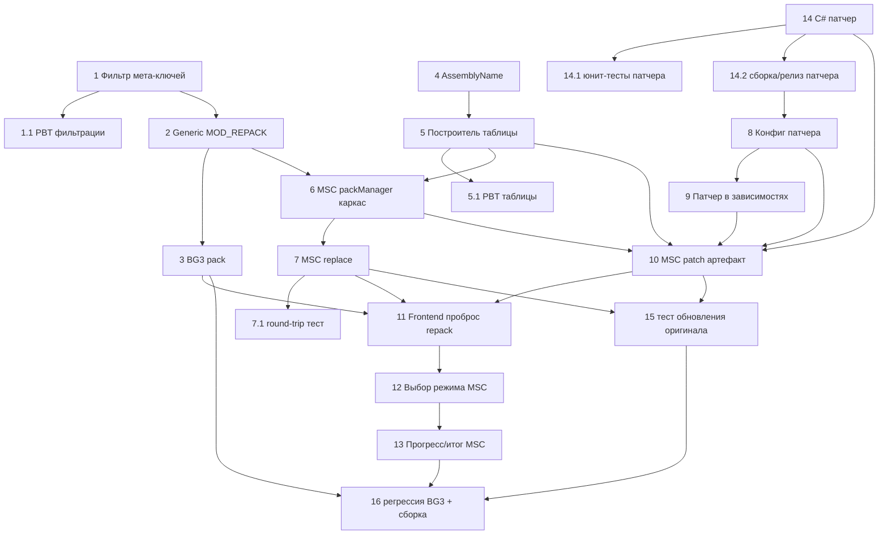

# Implementation Plan

## Overview

Порядок задач инкрементальный и снижает риск: сначала обобщаем контракт упаковки
(BG3 без регрессий), затем самый дешёвый MSC-режим `replace` (тул уже умеет
`inject`), потом patch-режим с артефактом и патчером, фронтенд и тесты. Тесты
оформлены отдельными задачами, привязанными к Correctness Properties из дизайна.

C#-патчер (`UltimaLocPatcher`) живёт в соседнем репозитории `ULTIMA_TOOLS` — для
него отдельный блок задач; остальные задачи правят этот (ULTIMA) репозиторий.

## Tasks

- [x] 1. Общий помощник фильтрации мета-ключей перевода
  - Создать чистую функцию (напр. `Backend/manager/shared_utils/translationData.js`):
    `stripMetaKeys(updatedData) -> { entries }`, исключающую `_bookmarks`,
    `_techOverride`, `_hidden`, `name`, `author`, `uuid`, `description`.
  - Функция чистая, без сайд-эффектов, не мутирует вход.
  - _Requirements: 1.4, 8.3_

- [x] 1.1 Property-тест: мета-ключи не утекают (Property 1)
  - PBT в стиле `Backend/tests/*`: для произвольного `updatedData` результат
    `stripMetaKeys` не содержит ни одного запрещённого ключа.
  - _Requirements: 1.4, 8.3_

- [x] 2. Обобщить обработчик `MOD_REPACK` в игро-независимый слой
  - Перенести регистрацию `MOD_REPACK` из `games/bg3/handlers/modHandlers.js` в
    общий слой (напр. новый `Backend/handlers/repackHandlers.js`,
    регистрируемый из `handlers/index.js` с доступом к `games`).
  - Хендлер принимает `gameId`, резолвит `games.getGameModule(gameId)` и вызывает
    `game.pack(input, ctx)`. `updatedData` передаётся БЕЗ фильтрации (BG3
    использует `name`/`author`/`uuid`/`description` для meta.lsx; фильтрацию
    мета-ключей делает каждая игра на своём шаге внедрения — см. задачу 5).
  - Если у модуля нет `pack` → вернуть `{ success:false, error }`, без падения.
  - `ctx` предоставляет `promptOutputPath(defaultName, filters)` (обёртка над
    `dialog.showSaveDialog`) и `onProgress(percent)`.
  - Удалить BG3-специфичную логику суффиксов/диалога из `modHandlers.js`
    (переедет в BG3 `pack`).
  - _Requirements: 1.1, 1.2, 1.5_

- [x] 3. Реализовать BG3 `pack()` поверх существующего `saveAndRepack` (без регрессий)
  - Добавить метод `pack(input, ctx)` в `Backend/games/bg3/index.js`
    (или в `projectModule.js`), переносящий нормализацию имени/языкового суффикса
    и вызов `bg3Manager.saveAndRepack(...)` из старого `MOD_REPACK`.
  - BG3 игнорирует `input.mode` (всегда patch-`.pak`); фильтры диалога — `.zip`.
  - Поведение и формат результата (`{ success, filePath }`) идентичны прежним.
  - _Requirements: 1.3, 7.1, 8.4_

- [x] 4. Расширить `assemblyInfo.js`: чтение имени целевой сборки
  - Добавить чтение `AssemblyName` (`module.Assembly.Name`) из DLL — нужно
    патчеру для поиска оригинала в рантайме.
  - Реализовать через MscLocTool (предпочтительно — поле в выводе) или дочитать
    из PE; вернуть `''`/`null` при ошибке, не падать.
  - _Requirements: 2.2, 4.3_

- [x] 5. Построитель таблицы переводов MSC (чистая функция)
  - Функция `buildTranslationTable(entries, extractedStrings, meta)`:
    оставляет только `id`, присутствующие в extract оригинала, с непустым
    (после trim) значением; формирует объект `{ schema, targetAssembly,
    originalModName, language, translator, appVersion, entries }`.
  - Идентификаторы через существующий `dll_utils/stringId.js` (контракт `MakeId`).
  - _Requirements: 2.3, 4.2, 4.3_

- [x] 5.1 Property-тесты построителя таблицы (Property 2, Property 3)
  - P2: все ключи таблицы — это id из extract; все значения непустые после trim.
  - P3: `makeStringId` детерминирован и совпадает с контрактом (sha256, 16 hex,
    префикс `u`) — сверка с фикстурами.
  - _Requirements: 2.2, 2.3, 4.2, 5.1_

- [x] 6. MSC pack-менеджер: каркас и переразрешение исходника
  - Создать `Backend/games/mysummercar/packManager.js` с `pack(input, ctx)`,
    диспетчеризующим по `input.mode` ('replace' | 'patch').
  - Реализовать переразрешение оригинального `.dll` из `input.originalPakPath`
    (для `.dll` — напрямую; для архива — повторная распаковка во temp через
    существующий `archiveDll`), т.к. ingest-temp удаляется.
  - Гарантировать неизменность исходного файла и очистку temp при любом исходе.
  - Подключить `pack` в `Backend/games/mysummercar/index.js`.
  - _Requirements: 1.5, 8.1, 8.2_

- [x] 7. MSC режим `replace` (fallback через `inject`)
  - В `packManager` реализовать ветку `replace`: вызвать
    `mscToolCli.inject(dllPath, table, outDll)`, упаковать результат в zip с
    `info.json` (метаданные перевода) либо отдать `.dll` (зафиксировать выбор).
  - Использовать `ctx.promptOutputPath` для пути сохранения и `onProgress`.
  - Вернуть `{ success, filePath, mode:'replace' }`.
  - _Requirements: 3.1, 3.3, 4.1, 4.3_

- [x] 7.1 Интеграционный тест round-trip замены (Property 4, Property 6)
  - На малой тестовой `.dll`: extract → buildTable → inject; проверить, что
    каждый `ldstr` с id в таблице равен переводу, прочие не изменены (P4).
  - Проверить, что хэш исходного `.dll` до/после упаковки совпадает (P6).
  - _Requirements: 2.1, 2.3, 3.3, 8.1_

- [x] 8. Конфиг и дистрибуция патчера `UltimaLocPatcher`
  - Расширить `Backend/games/mysummercar/toolConfig.js`: добавить вторую запись
    инструмента (имя, версия, размер, DOWNLOAD_URL на релиз ULTIMA_TOOLS,
    sidecar-версия) — по образцу `MscLocTool`.
  - Обновить `dll_utils/mscToolDownloader.js`/`mscToolCli.js` (или добавить
    параллельные обёртки) так, чтобы поддерживать несколько инструментов в
    `Tools/MSC/`.
  - _Requirements: 6.1_

- [x] 9. Включить патчер в систему зависимостей (статус-виджет + блокировка)
  - Расширить `checkDependencies()` в `index.js`: возвращать оба инструмента в
    `tools[]` со статусом ('installed'|'missing'|'update') и корректный
    `missing[]`; `ok` учитывает наличие патчера для patch-режима.
  - `installDependencies(onProgress, toolId)` должен ставить конкретный
    инструмент по `toolId`.
  - Patch-сборка блокируется при отсутствии патчера и направляет в существующий
    поток зависимостей (без внезапной ошибки в момент упаковки).
  - Переиспользовать существующую проверку .NET, не дублировать.
  - _Requirements: 6.1, 6.2, 6.3_

- [x] 10. MSC режим `patch`: формирование артефакта
  - В `packManager` реализовать ветку `patch`: собрать zip со структурой из
    дизайна §4 — `Mods/UltimaLocPatcher.dll`,
    `Mods/Config/UltimaLoc/<modid>.json` (таблица + манифест), `info.txt`.
  - Копировать патчер из `Tools/MSC/`, не модифицировать оригинальный `.dll`.
  - Использовать `ctx.promptOutputPath`/`onProgress`; вернуть
    `{ success, filePath, mode:'patch' }`; очищать частичный zip при сбое.
  - _Requirements: 2.1, 4.1, 4.2, 4.3, 8.1, 8.2_

- [x] 11. Frontend: проброс параметров упаковки
  - Расширить API `repack(...)` (`preload` + `Frontend/API/...` + `ProjectService
    .handleSavePak`) параметрами `gameId`, `mode`, `originalPakPath`.
  - Передать активную игру и путь оригинала из состояния проекта.
  - BG3-путь не меняет поведения (один режим).
  - _Requirements: 7.1_
  - Примечание: выполнено вместе с задачей 2, чтобы не оставлять renderer в
    нерабочем состоянии после смены payload `MOD_REPACK` (теперь требует `gameId`).

- [x] 12. Frontend: выбор режима для MSC (patch/replace)
  - Перед сборкой MSC показывать выбор «Патч (рядом с оригиналом)» / «Замена DLL»
    с пояснением последствий (в т.ч. предупреждение об обновлении оригинала при
    замене). Реализация — расширение `PackModal` или MSC-ветка.
  - Для BG3 диалог выбора не показывается.
  - Локали для подписей/пояснений в `Frontend/Locales/{ru,en}.js`.
  - _Requirements: 3.2, 5.3, 7.2_

- [x] 13. Frontend: прогресс и итог упаковки MSC
  - Переиспользовать существующий паттерн прогресса и нотификаций
    (`packed`/`packError`): показывать состояние сборки и итог (успех с путём /
    ошибка с причиной).
  - Убедиться, что BG3-специфичные поля (UUID, словарь) остаются скрыты для MSC.
  - _Requirements: 7.3, 7.4_

- [x] 14. [ULTIMA_TOOLS] C#-патчер `UltimaLocPatcher` (MSCLoader-мод)
  - Создать MSCLoader-мод: на загрузке читать таблицы из
    `Mods/Config/UltimaLoc/*.json` и их манифесты (целевая сборка).
  - Находить загруженную сборку оригинала по `AssemblyName`; применять Harmony
    **transpiler** ко всем методам её типов; для каждого `ldstr` вычислять
    `id = MakeId(operand)` и подменять операнд на перевод при наличии непустой
    записи в таблице.
  - `MakeId` идентичен `Program.cs`/`stringId.js` (sha256, 16 hex, префикс `u`).
  - Обработка отказов: целевая сборка не найдена / Harmony недоступен → лог, мод
    не падает, строки остаются оригинальными.
  - _Requirements: 2.1, 2.2, 2.3, 5.1, 5.2_
  - Готово: исходник в `tools/MSC-Patcher/` (src/LocId, LocStore(+Io), LocPatch,
    UltimaLocMod). Собирается реально (`dotnet build -c Release` →
    `UltimaLocPatcher.dll`) против MSCLoader 1.4.2 + Harmony 1.2 (namespace
    `Harmony`/`HarmonyInstance` — НЕ HarmonyX). Запуск в игре — smoke на стороне
    пользователя.

- [x] 14.1 [ULTIMA_TOOLS] Юнит-тесты патчера (Property 5)
  - На синтетических методах: литерал переводится тогда и только тогда, когда
    `id` есть в таблице; отсутствующие `id` оставляют оригинал (не пустую строку).
  - Юнит на `MakeId` (сверка с фикстурами контракта).
  - _Requirements: 2.2, 2.3, 5.2_
  - Готово: `tools/MSC-Patcher/tests` (net8 console, линкует чистые LocId+LocStore).
    5 тестов зелёные, вкл. golden-векторы из Node makeStringId (кросс-язык).

- [x] 14.2 [ULTIMA_TOOLS] Сборка и релиз патчера
  - Настроить сборку патчера (CI/workflow в ULTIMA_TOOLS) и публикацию ассета
    под тегом `msc-tools-v<версия>` (по образцу `MscLocTool`).
  - Обновить DOWNLOAD_URL/версию в `toolConfig.js` (задача 8) на реальный релиз.
  - _Requirements: 6.1_
  - ВЫПОЛНЕНО (релиз опубликован): проект сделан CI-собираемым без игровых DLL —
    net35 через NuGet `Microsoft.NETFramework.ReferenceAssemblies.net35`, deps —
    редистрибутируемые `References/{MSCLoader,0Harmony,Newtonsoft.Json}.dll`.
    В `N1ko-Pro/ULTIMA_TOOLS` запушены: ветка `feat/loc-patcher` (исходник
    `UltimaLocPatcher/` + `.github/workflows/build-loc-patcher.yml`) и тег
    `loc-patcher-v1.0.0`. CI отработал успешно (тесты+сборка), создан prerelease
    с ассетом `UltimaLocPatcher.dll` (10 КБ, refs mscorlib 2.0.0.0 / MSCLoader
    1.4.2 / 0Harmony 1.2.0.1). Скачивание по URL из `toolConfig.js`
    (`MSC_PATCHER.downloadUrl`) проверено (HTTP 200, валидная managed-сборка).
    ОСТАЁТСЯ по желанию: смержить PR `feat/loc-patcher` → main в ULTIMA_TOOLS.

- [x] 15. Тесты устойчивости к обновлению оригинала (Property 7)
  - PBT/интеграция: при изменении части строк оригинала переводы с совпавшими
    `id` продолжают применяться; несовпавшие игнорируются без ошибок.
  - _Requirements: 5.1, 5.2_
  - Примечание: Node-сторона (построитель таблицы) покрыта в
    `mscTranslationTable.test.js`. Рантайм-аспект (патчер игнорирует отсутствующие
    id) проверяется юнит-тестами патчера — задача 14.1 (ULTIMA_TOOLS).

- [x] 16. Регрессионная проверка BG3 и финальная сборка
  - Прогнать существующие тесты и убедиться, что BG3 `saveAndRepack` через новый
    контракт даёт прежний `.pak` (структура Mods/Localization + зависимость).
  - Запустить сборку/линт проекта; устранить ошибки; убрать временные файлы.
  - _Requirements: 1.3, 8.4_
  - Готово (авто): `npm test` (79) зелёный, `npm run lint` чистый, `npm run build`
    (vite) проходит, C#-патчер `dotnet build` + тесты зелёные. BG3 pack зовёт
    `saveAndRepack` 1:1 (поведение не менялось). Живая проверка BG3/MSC в самом
    приложении — за пользователем.

## Task Dependency Graph

```json
{
  "waves": [
    { "wave": 1, "tasks": ["1", "4", "14"] },
    { "wave": 2, "tasks": ["1.1", "2", "5", "14.1", "14.2"] },
    { "wave": 3, "tasks": ["3", "5.1", "6", "8"] },
    { "wave": 4, "tasks": ["7", "9"] },
    { "wave": 5, "tasks": ["7.1", "10"] },
    { "wave": 6, "tasks": ["11", "15"] },
    { "wave": 7, "tasks": ["12"] },
    { "wave": 8, "tasks": ["13"] },
    { "wave": 9, "tasks": ["16"] }
  ]
}
```



## Notes

- C#-задачи (14, 14.1, 14.2) выполняются в репозитории `ULTIMA_TOOLS`; их релиз
  (14.2) разблокирует реальный DOWNLOAD_URL патчера в задаче 8.
- BG3-путь должен оставаться без регрессий на протяжении всего плана — задачи 2,
  3 и 16 это контролируют.
- Тестовые задачи (1.1, 5.1, 7.1, 14.1, 15) реализуют Correctness Properties
  P1–P7 из design.md; держать их рядом с соответствующей логикой.
- Не коммитить и не пушить (включая теги ULTIMA_TOOLS) без явной просьбы.
