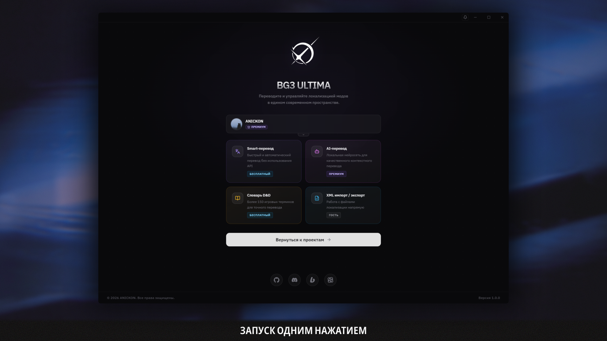
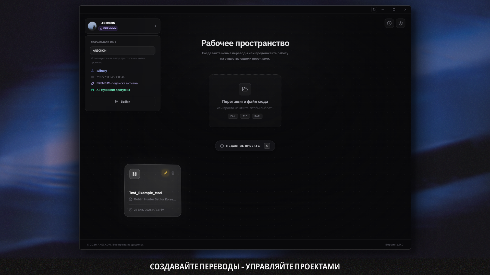
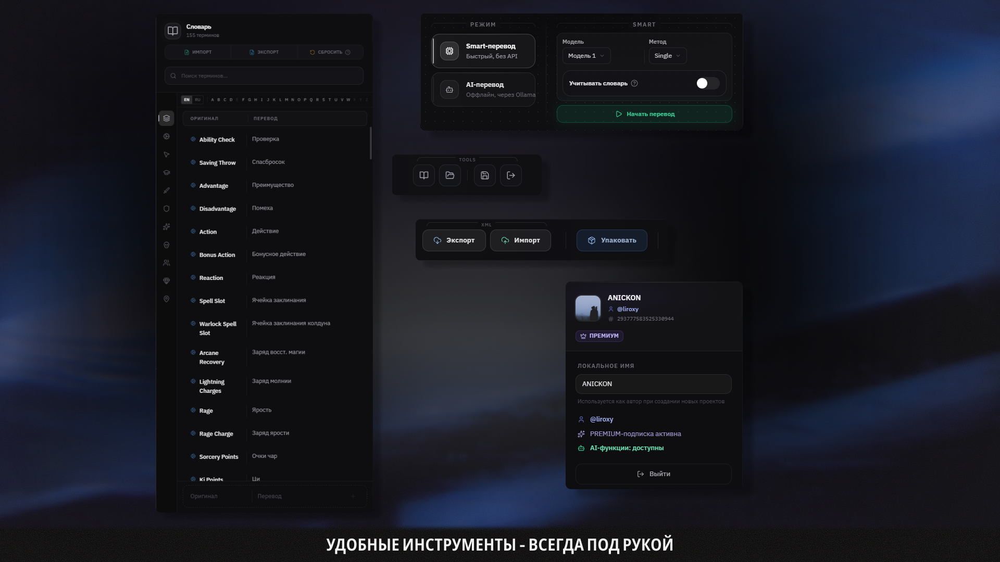
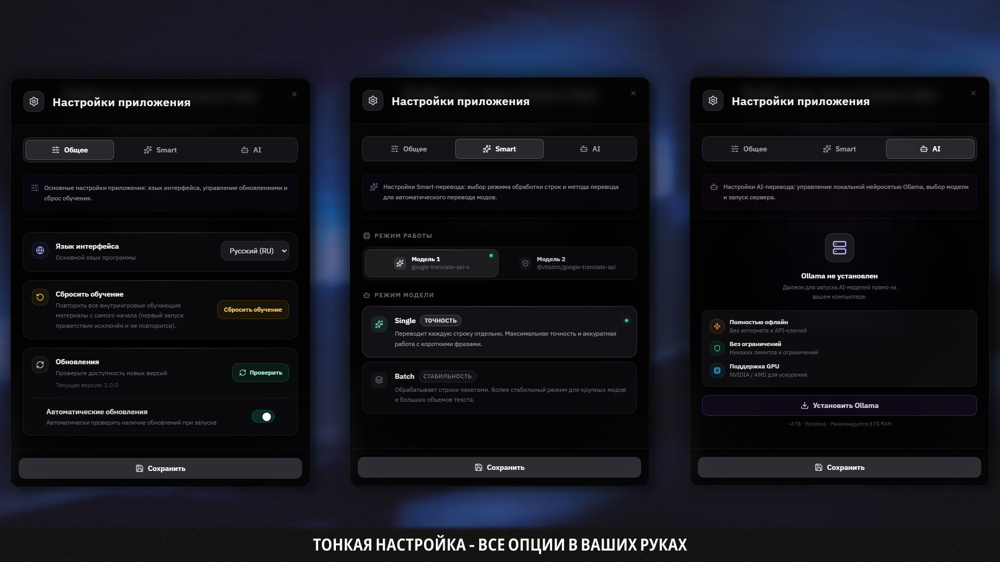

 
# ULTIMA
 

 
---
 
**ULTIMA** — современный визуальный редактор и автоматический переводчик модификаций для Baldur's Gate 3...
 

---

## 📥 Скачать

*Установщик для Windows · Поддерживает автообновления*

---

## ✨ Возможности

| Feature | Description |
|---------|-------------|
| ⚡ **Импорт и экспорт** | Поддержка .pak, .xml, .loca файлов Baldur's Gate 3 |
| 📝 **Удобная таблица** | Оригинал и перевод рядом, быстрый поиск, фильтрация, подсветка совпадений |
| 🤖 **Автоматический перевод** | Интеграция с Google Translate и другими сервисами, пакетная обработка |
| 🧠 **ИИ-перевод** | Локальные LLM модели через Ollama для качественного перевода |
| 💾 **Безопасное сохранение** | Система отслеживания несохранённых изменений, защита от потери данных |
| 🧩 **Проверка целостности** | Валидация обязательных полей, подсветка ошибок, рекомендации по UUID |
| 🎨 **Современный интерфейс** | Тёмная тема, плавные анимации, кастомный titlebar, адаптивный дизайн |
| 🛠️ **Горячие клавиши** | Поддержка Ctrl+S (сохранить), Ctrl+X (вырезать), Ctrl+Z (вернуть), Ctrl+F (поиск) |
| 🗂️ **История проектов** | Быстрый доступ к последним переводам, автосохранение |

---

## 📸 Скриншоты

<table>
  <tr>
    <td align="center" width="50%">
      
       <b>🏠 Главная страница</b>
    </td>
    <td align="center" width="50%">
      
       <b>📝 Рабочее пространство</b>
    </td>
  </tr>
  <tr>
    <td align="center">
      
       <b>📊 Таблица переводов</b>
    </td>
    <td align="center">
      
       <b>🛠️ Инструменты перевода</b>
    </td>
  </tr>
  <tr>
    <td align="center" colspan="2">
      
       <b>⚙️ Настройки приложения</b>
    </td>
  </tr>
</table>

---

## 🎯 Для кого этот проект

- 🌍 **Локализаторы и переводчики модов BG3** — профессиональные инструменты для качественного перевода
- 🎮 **Авторы модификаций** — быстро добавьте поддержку русского языка в свои моды
- 💻 **Все кто ценит удобство** — современный интерфейс, скорость и безопасность работы с текстами

---

## 🛠️ Технологии

<table>
  <thead>
    <tr>
      <th>Category</th>
      <th>Technology</th>
      <th>Description</th>
    </tr>
  </thead>
  <tbody>
    <tr>
      <td rowspan="4" align="center"><strong>Frontend</strong></td>
      <td>React 19.2</td>
      <td>UI библиотека</td>
    </tr>
    <tr>
      <td>Vite 8.0</td>
      <td>Сборщик и dev-сервер</td>
    </tr>
    <tr>
      <td>TailwindCSS 3.4</td>
      <td>Стилизация</td>
    </tr>
    <tr>
      <td>Lucide React</td>
      <td>Иконки</td>
    </tr>
    <tr>
      <td rowspan="4" align="center"><strong>Backend</strong></td>
      <td>Electron 41.1</td>
      <td>Десктопное приложение</td>
    </tr>
    <tr>
      <td>Node.js</td>
      <td>Серверная часть</td>
    </tr>
    <tr>
      <td>Electron Builder 26.8</td>
      <td>Сборка установщиков</td>
    </tr>
    <tr>
      <td>GitHub Releases</td>
      <td>Автообновления</td>
    </tr>
    <tr>
      <td rowspan="3" align="center"><strong>Интеграции</strong></td>
      <td>Google Translate API</td>
      <td>Автоматический перевод</td>
    </tr>
    <tr>
      <td>Ollama</td>
      <td>Локальные LLM модели</td>
    </tr>
    <tr>
      <td>Discord</td>
      <td>Авторизация и сообщество</td>
    </tr>
  </tbody>
</table>

---

## 📖 Использование

1. Запустите приложение
2. Импортируйте мод (.pak) или XML файл
3. Выберите строки для перевода
4. Используйте автоматический перевод или переведите вручную
5. Экспортируйте результат в .pak файл

---

## 📬 Обратная связь

Если вы нашли баг или хотите предложить улучшение — обращайтесь в [Discrod](https://discord.gg/nxFghu8pWp) или создайте [Issue](https://github.com/N1ko-Pro/BG3-ULTIMA/issues).

---

## 📄 Лицензия

**Важно: Этот проект НЕ является open-source.**

BG3 ULTIMA распространяется под проприетарной лицензией. Код программы предоставляется для ознакомления, но его использование ограничено:

**✅ Разрешено:**
- Использовать программу для личной некоммерческой работы над переводами
- Создавать, редактировать и распространять переводы модов, полученные в программе
- Делиться получившимися файлами локализации в соответствии с лицензиями исходных модов

**❌ Запрещено:**
- Форкать репозиторий или создавать производные проекты
- Модифицировать исходный код программы
- Продавать, сдавать в аренду или сублицензировать саму программу
- Реверсить, декомпилировать и дизассемблировать программу

Полные условия использования указаны в лицензионном соглашении (EULA), которое появляется при первом запуске программы.

---

**Сделано с ❤️ для сообщества BG3**

[⬆ Вернуться к началу](#bg3-ultima)

